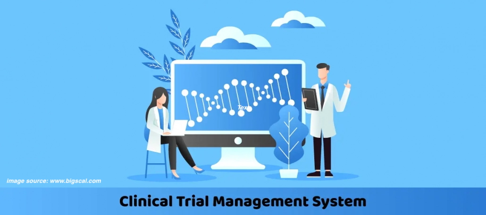
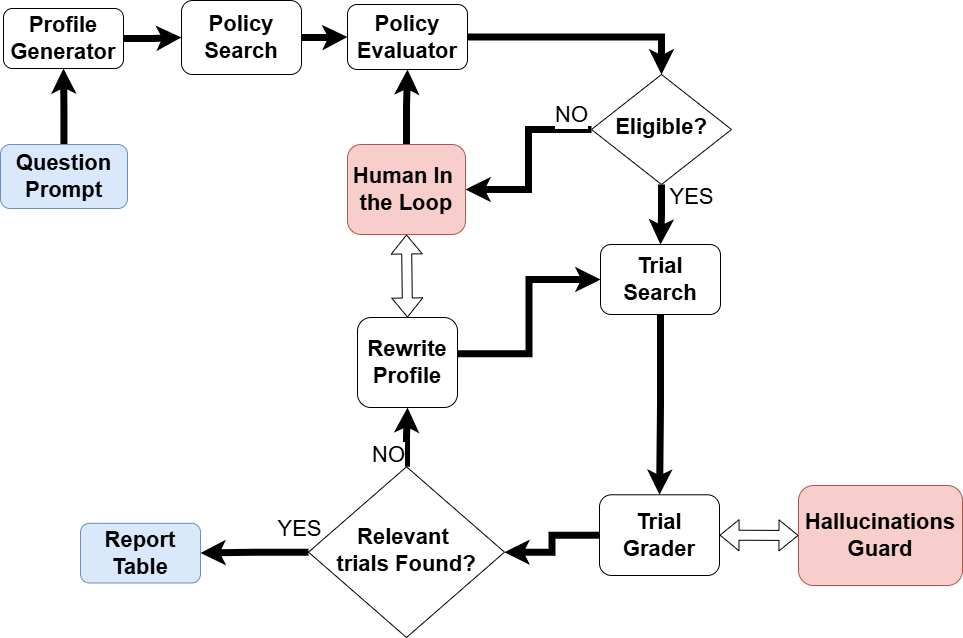
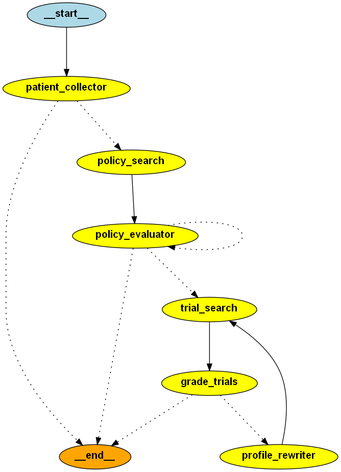

# 

# LLM Pharma - Clinical Trial Management System

[](https://www.python.org/)
[](https://langchain.com/)
[](https://langchain.com/langgraph)
[](https://groq.com/)
[](https://openai.com/)
[](https://nomic.ai/)
[](https://chromadb.com/)
[](https://gradio.app/)
[](https://sqlite.org/)
[](https://hydra.cc/)
[](https://python-poetry.org/)
[](https://pytest.org/)

A comprehensive LLM-powered system for evaluating patient eligibility for clinical trials using advanced agent-based workflows, vector databases, and interactive web interfaces.

## 🔬 Overview

LLM Pharma is an intelligent clinical trial management system that automates the evaluation of patients for potential clinical trials. The system utilizes Large Language Models (LLMs), vector databases, and agent-based workflows to:

- **Analyze patient medical histories** and generate comprehensive profiles
- **Evaluate eligibility** against institutional policies and trial criteria
- **Match patients** to relevant clinical trials with detailed explanations
- **Prevent hallucinations** through advanced grading and verification systems
- **Provide interactive dashboards** for clinical research coordinators

## 🧩 Process Flow

The LLM Pharma system follows a structured process flow to evaluate patient eligibility for clinical trials:



1. **Data Collection and Preprocessing**: Import and prepare patient data for analysis
2. **Patient Profile Analysis**: Utilize LLMs to analyze patient data and extract relevant information
3. **Eligibility Verification**: Assess patient data against clinical trial policies to determine eligibility
4. **Trial Matching**: Use agentic workflows to identify suitable trials for patients
5. **Hallucination Prevention**: Implement a hallucination grader to ensure model outputs are contextually accurate

## 📊 Features

### Core Capabilities

- **Patient Data Management**: SQLite database with 100+ demo patients
- **Semantic Search**: ChromaDB vector stores with Nomic embeddings
- **Multi-Model LLM**: Groq and OpenAI integration with fallback logic
- **Policy Evaluation**: Automated compliance checking with ReAct agent
- **Trial Matching**: Intelligent matching with metadata filtering
- **Hallucination Prevention**: Advanced grading with verification
- **Interactive Interface**: Modern web UI with real-time processing

### Advanced Features

- **Self-Query Retrieval**: Metadata-aware trial search
- **Multi-step Workflows**: LangGraph-based agent orchestration  
- **Tool Integration**: Date calculations and numerical operations
- **Profile Rewriting**: Adaptive profile enhancement for better matches
- **Thread Management**: Multi-session support with state persistence
- **Demo Mode**: Dummy workflow for testing and demonstration
- **Configuration Management**: Hydra-based flexible configuration

## 🗄️ Demo Databases

The system includes demo databases for:

- **Patients**: A SQLite database with 100+ demo patients
- **Diseases**: A comprehensive list of diseases for trial matching
- **Clinical Trials**: Data on various clinical trials for matching
- **Clinical Policies**: Institutional policies stored in ChromaDB for compliance checking

## 🧠 RAG Strategies and Human-in-the-Loop

- **RAG Strategies**: The system employs different Retrieval-Augmented Generation strategies to enhance trial matching
- **Hallucination Guard**: Advanced grading and verification systems prevent hallucinations in model outputs
- **Human-in-the-Loop**: Allows clinical research coordinators to review and adjust trial matching results

## 🛠️ Tech Stack

- **Python 3.12+**: Core programming language
- **LangChain**: Framework for building LLM applications
- **LangGraph**: Workflow orchestration and agent management
- **Groq**: Primary LLM provider with multiple model options
- **OpenAI**: Alternative LLM provider for GPT models
- **Nomic**: Embeddings for semantic search
- **ChromaDB**: Vector database for semantic search
- **Gradio**: Web interface framework
- **SQLite**: Relational database for patient data
- **Hydra**: Configuration management
- **Poetry**: Dependency management
- **Pytest**: Testing framework

## 🚀 Quick Start

### Prerequisites

- Python 3.12+
- Poetry (for dependency management)
- Groq API key (primary) or OpenAI API key (alternative)

### Installation

1. **Clone the repository and navigate to the llm_pharma directory**:
   ```bash
   cd llm_pharma
   ```

2. **Install dependencies using Poetry**:
   ```bash
   make dev-install
   ```

3. **Set up environment variables**:
   ```bash
   # Create .env file with your API keys
   echo "GROQ_API_KEY=your_groq_api_key_here" > .env
   echo "OPENAI_API_KEY=your_openai_api_key_here" >> .env
   ```

4. **Set up data** (required for first run):
   ```bash
   make setup-data
   ```

### Running the Application

#### Web Interface (Recommended)
```bash
make run
```
Then visit `http://127.0.0.1:7958` in your browser.

#### Demo Mode (for testing)
```bash
python frontend/app.py --demo
```

#### With Custom Configuration
```bash
python frontend/app.py --host 0.0.0.0 --port 8080 --share
```

## 🏗️ Architecture

The system is built using a modular architecture with the following key components:



### Backend Modules (`backend/my_agent/`)
- **WorkflowManager**: Orchestrates the LangGraph-based evaluation workflow
- **LLMManager**: Handles multiple LLM models with fallback logic (Groq/OpenAI)
- **DatabaseManager**: Manages SQLite patient database and ChromaDB vector stores
- **PolicyService**: Handles policy evaluation and eligibility assessment
- **TrialService**: Manages trial matching and relevance scoring
- **PatientCollector**: Handles patient data collection and profile generation
- **State Management**: TypedDict-based workflow state management

### Frontend (`frontend/`)
- **Gradio Web Interface**: Interactive dashboard with multi-tab results
- **Real-time Processing**: Live workflow execution with status updates
- **Thread Management**: Multi-session support with state persistence
- **Demo Mode**: Dummy workflow for testing and demonstration

### Data Setup (`scripts/`)
- **Master Setup Script**: Complete data initialization
- **Patients Database Creator**: SQLite database with demo patients
- **Policies Vector Store Creator**: ChromaDB for institutional policies
- **Trials Vector Store Creator**: ChromaDB for clinical trials data

### Configuration (`config/`)
- **Hydra Configuration**: Centralized config management with YAML files
- **Environment Management**: Secure API key and settings management

## 📁 Project Structure

```
llm_pharma/
├── backend/                  # Backend modules
│   ├── my_agent/            # Core agent modules
│   │   ├── workflow_manager.py    # LangGraph workflow orchestration
│   │   ├── llm_manager.py         # Multi-model LLM management
│   │   ├── database_manager.py    # Database and vector store operations
│   │   ├── policy_service.py      # Policy evaluation and tools
│   │   ├── trial_service.py       # Trial matching and scoring
│   │   ├── patient_collector.py   # Patient data collection
│   │   └── State.py               # Workflow state management
│   └── README.md            # Backend documentation
├── frontend/                # Gradio web interface
│   ├── app.py               # Main frontend application
│   ├── helper_gui.py        # Comprehensive Gradio interface
│   ├── demo_graph.py        # Demo mode with dummy workflow
│   └── README.md            # Frontend documentation
├── scripts/                 # Data setup scripts
│   ├── setup_all_data.py    # Master setup script
│   ├── create_patients_database.py      # Patients database creator
│   ├── create_policies_vectorstore.py   # Policies vector store creator
│   ├── create_trials_vectorstore.py     # Trials vector store creator
│   └── README.md            # Scripts documentation
├── config/                  # Configuration files
│   └── config.yaml          # Main configuration
├── tests/                   # Test suite
│   ├── unit/                # Unit tests
│   ├── integration/         # Integration tests
│   └── regression/          # Regression tests
├── data/                    # Data files
├── vector_store/            # ChromaDB vector stores
├── sql_server/              # SQLite databases
├── source_data/             # Source documents
├── pyproject.toml           # Poetry configuration
├── Makefile                 # Development automation
└── README.md               # This file
```

## 🔧 Configuration

The system uses Hydra for configuration management. Key configuration files:

- `config/config.yaml`: Main configuration file
- Environment variables: `GROQ_API_KEY`, `OPENAI_API_KEY`

### Key Configuration Options

```yaml
# Model settings
models:
  agent_models:
    - id: "mistral-saba-24b"
      provider: "groq"
  tool_models:
    - id: "llama-3.3-70b-versatile"
      provider: "groq"

# Directory paths
directories:
  sql_server: "sql_server"
  vector_store: "vector_store"

# File paths
files:
  policy_markdown: "source_data/instut_trials_policy.md"
  trials_csv: "data/trials_data.csv"
```

## 🎯 Usage Examples

### Web Interface Usage

1. **Start the web interface**:
   ```bash
   make run
   ```

2. **Enter a patient query**:
   ```
   Is patient 15 eligible for any clinical trials?
   ```

3. **Review results** in the detailed tabs:
   - **Agent Tab**: Workflow control and status
   - **Patient Profile**: Generated patient summary (editable)
   - **Policy Evaluation**: Institutional policy compliance
   - **Trials Summary**: Overview of matched trials
   - **Potential Trials**: Detailed trial information
   - **Trials Scores**: Comprehensive scoring and ranking

### Programmatic Usage

```python
from omegaconf import OmegaConf
from backend.my_agent.workflow_manager import WorkflowManager

# Load configuration
config = OmegaConf.load("config/config.yaml")

# Initialize workflow manager
workflow_manager = WorkflowManager.from_config(config)

# Run evaluation
result = workflow_manager.run_workflow(
    patient_prompt="Is patient 5 eligible for any medical trial?",
    thread_id="example_session"
)

# Process results
print(f"Patient ID: {result['patient_id']}")
print(f"Policy Eligible: {result['policy_eligible']}")
print(f"Trials Found: {result['trial_found']}")
```

## 🔄 Development Workflow

### Available Make Commands

```bash
make install            # Install production dependencies
make dev-install        # Install development dependencies
make run               # Run Gradio frontend
make setup-data        # Set up all data (patients, policies, trials)
make test-all          # Run all tests
make test-unit         # Run unit tests only
make test-integration  # Run integration tests only
make test-regression   # Run regression tests
make lint              # Run linting (ruff)
make format            # Format code (black, isort)
make check             # Run all checks (lint + format + test)
make clean             # Clean up build artifacts
```

### Code Quality Tools

- **Ruff**: Fast Python linter
- **Black**: Code formatting
- **isort**: Import sorting
- **pytest**: Testing framework

## 🧪 Testing

The project includes comprehensive unit, integration, and regression tests:

```bash
# Run all tests
make test-all

# Run unit tests only
make test-unit

# Run integration tests only  
make test-integration

# Run regression tests
make test-regression
```

### Test Coverage

- **Unit Tests**: Individual module functionality
- **Integration Tests**: Module interaction testing
- **Regression Tests**: End-to-end workflow validation

## 🔒 Security & Privacy

- **Synthetic Data**: All patient data is synthetic and created for demonstration purposes - no real names or persons are used
- **Secure Configuration**: Environment-based API key management
- **Input Validation**: Comprehensive data validation and sanitization
- **Error Handling**: Graceful error handling with informative messages

## 📈 Performance

- **Model Fallback**: Automatic switching between LLM providers
- **Caching**: Vector store persistence for faster retrieval
- **Optimized Queries**: Efficient database operations
- **Memory Management**: SQLite checkpointing for workflow state

## 📚 Documentation

For detailed information about specific components:

- **[Backend Documentation](backend/README.md)**: Core modules and workflow
- **[Frontend Documentation](frontend/README.md)**: Web interface and usage
- **[Scripts Documentation](scripts/README.md)**: Data setup and management

## 🤝 Contributing

1. **Fork the repository**
2. **Create a feature branch**: `git checkout -b feature/amazing-feature`
3. **Install development dependencies**: `make dev-install`
4. **Make your changes** and add tests
5. **Run the test suite**: `make check`
6. **Commit your changes**: `git commit -m 'Add amazing feature'`
7. **Push to the branch**: `git push origin feature/amazing-feature`
8. **Open a Pull Request**

### Development Guidelines

- Follow PEP 8 style guidelines
- Add type hints to all functions
- Write comprehensive tests for new features
- Update documentation as needed
- Use descriptive commit messages

## 📄 License

This project is licensed under the MIT License - see the [LICENSE](LICENSE) file for details.

## 📞 Support

For questions, issues, or contributions:

1. **Check the Issues**: Look for existing issues or create a new one
2. **Documentation**: Review component-specific README files
3. **Tests**: Run the test suite to verify functionality  

## 🚧 Future Enhancements

- **Enhanced RAG**: Graph-based retrieval with entity relationships
- **Multi-modal Support**: Image and document processing
- **Advanced Analytics**: Trial success prediction and patient outcome analysis
- **Integration APIs**: RESTful APIs for external system integration
- **Scalability**: Distributed processing and cloud deployment options
- **Embedding Optimization**: Fine-tuning of embeddings for clinical domain specificity

---

**Note**: This system is designed for research and demonstration purposes. For production clinical trial management, consult with healthcare professionals and ensure compliance with relevant regulations and standards.

## 👨‍💻 Author

**Bob Hosseini**

- **Email**: [bbkhosseini@gmail.com](mailto:bbkhosseini@gmail.com)
- **LinkedIn**: [linkedin.com/in/bobhosseini](https://linkedin.com/in/bobhosseini)
- **GitHub**: [github.com/bab-git](https://github.com/bab-git)
- **Website**: [bob-hosseini-portfolio.web.app](https://bob-hosseini-portfolio.web.app/)

---

*Built with ❤️ for advancing clinical trial management through AI* 